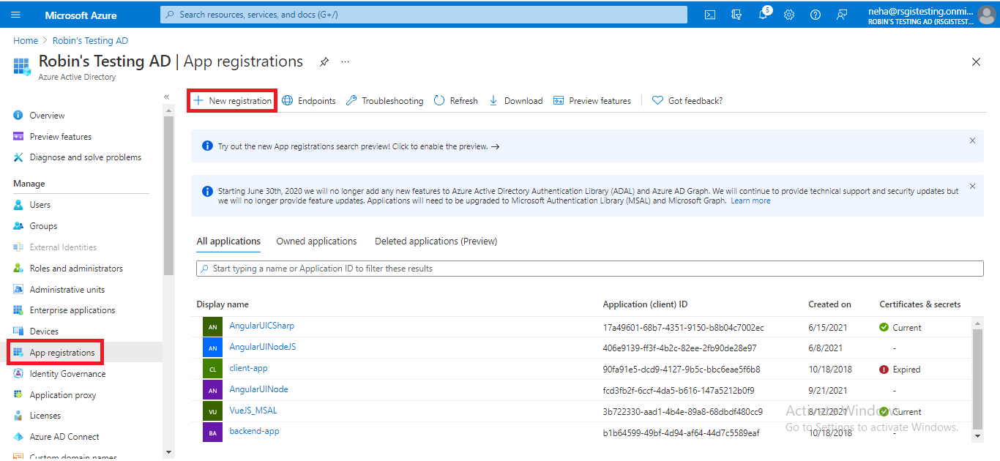
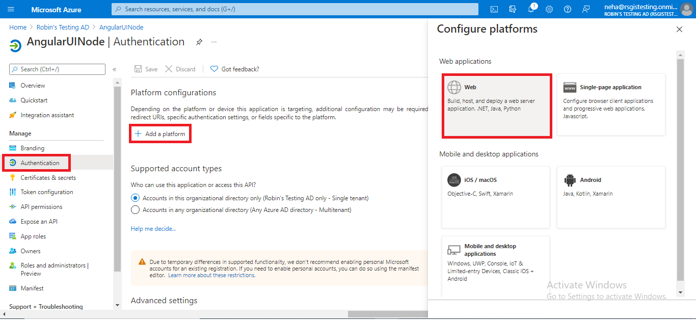
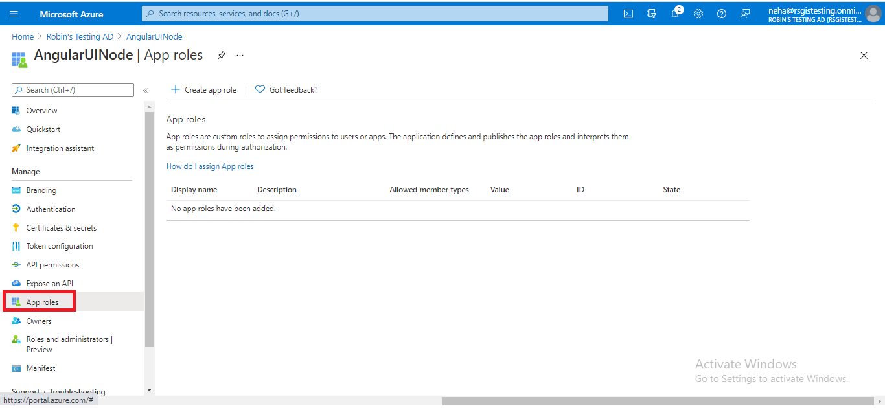

# Developing Angular UI with Azure AD authentication (using MSAL) communicating with C# back end

<!-- TOC -->
**Overview**: 

- [Prerequisites before you download any code](#prerequisites-before-you-download-any-code)
- [Step 1: Azure Active Directory](#step-1-azure-active-directory)
- [Step 2: To Run Locally](#step-2-to-run-locally)

<!-- TOC -->

## Objectives

This sample shows you how to create a univseral authentication with Azure. The token is then used by the auth interceptor every time it needs to talk to back-end service.
We are showing capabilities how to talk to multiple back-end services written in different languages that communicate with different Azure services.
These back-end services are itself REST API complaint services. Source code to those services are available.
  
Each button in the UI talks to different REST end points. The code was deployed on App Service (.NET Core 3) and not a Static Web Site.
  
   1. Windows Services 

   1. Run Powershell Script - Uses SignalR services to fire a Power Shell script execution and returns the long waiting response back to the UI 

   1. Database Connection -  Communicates with Azure SQL DB using C#
   
Link to the working Angular UI
https://angui-2-csharp.azurewebsites.net/
## Prerequisites before you download any code

* Before you can run this sample, you must have the following perquisites:
* Visual Studio Code ( Latest Version ) - If you don't have this editor, refer to the [Download Visual  Studio Code](https://code.visualstudio.com/download) link.
* [npm] (https://www.npmjs.com/package/download) version 6 and higher
* [Git](http://git-scm.com/).
* Azure Active Directory
  
# Step 1: Azure Active Directory (App registration)
This application does external Authentication with Azure AD. Use Azure Active Directory to create App registration. Use the following steps to get app registration details.
## Create new app registration

1. In the Azure Portal, select **Azure Active Directory**


&nbsp;

2. Click on the **App registrations** button then click on **New registration**

 
&nbsp;

3. Fill out the **Form** inputs as follows:
- **Name:** Enter a display Name for your application
- Specify who can use the application

## Configure platform settings

1. Under Manage, select **Authentication**
2. Under Platform configurations, select **Add a platform**
3. Under Configure platforms, select the **Web platform** for your application

 
&nbsp;

4. Add **redirect URL**, select both **access token** and **ID token**


&nbsp;

5. Click on configure

## Add app roles

1. Under Manage, select **App Roles**


&nbsp;

2. Click on **Create app role**


&nbsp;

3. Fill out **Form** inputs as follow:
- **Display name:** for the app role that appears in the admin consent and app assignment experiences
- **Allowed member types:** Specifies whether this app role can be assigned to users, applications, or both
- **Value:** Specifies the value of the roles claim that the application should expect in the token
- **Description** add description
4. Select Apply to save your changes

## Add Scopes

1. Under Manage, select **Expose an API**


&nbsp;

2. Click on **Add a scope**


&nbsp;

3. You're prompted to set an **Application ID URI** if you haven't yet configured one


&nbsp;

4. Click on **Save and continue**
5. Next, specify the scope's attributes in the Add a scope pane


&nbsp;

6. Fill out **Form** inputs as follow:
- **Scope name:** The name of your scope. Here you add **access_as_user**
- **Who can consent:** select **Admins and users**
- **Admin consent display name:** A short description of the scope's purpose that only admins will see
- **Admin consent description:** add description

# Step 2: To Run Locally
1. Clone the repository

      ```bash
      git clone https://github.com/RobinGhoshATL/angui-2-csharp.git
      cd angui-2-csharp 
      ```

2. Substitute `tenant, clientId and domain` in `src/app/shared/helpers/msal-config.ts` file.
Get your `tenant, cliendId and domain` from your app registration in Azure Active Directory.

      ```bash
      export function getMsalConfig() {
        return {
          tenant: '~your tenant Id here',
          clientId: '~your client Id here',
          redirectUri: window.location.origin,
          domain: "~your domain name here",
          endpoints: { "https://graph.microsoft.com": "https://graph.microsoft.com" },
          navigateToLoginRequestUrl: false,
          extraQueryParameter: "scope=user.read",
          cacheLocation: "localStorage",
          expireOffsetSeconds: "1200",
        };
      }
      ```   

3. Check `base_href` in `src/app/app.init.ts` file. It's value should be `https://csharp-be.azurewebsites.net/`

   ```bash
   base_href: '~your C# endpoint here',
   ```
4. Run `npm install` in a terminal to install required npm modules

5. Run `ng serve` in a terminal to start your angular application.  Navigate to `http://localhost:4200/`. The app will automatically reload if you change any of the source files.

CONGRATULATIONS. If you are redirct to Microsoft login page and after login redirect to dashboard page, you are successfully run this application locally.

# Build

Run `ng build` to build the project. The build artifacts will be stored in the `dist/` directory. Run `ng build --prod` for a production build.

